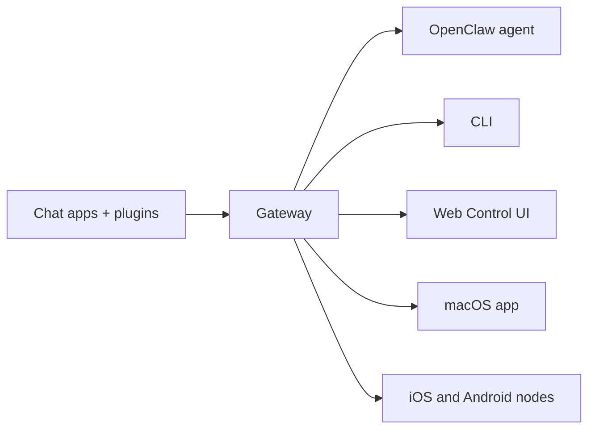

> 🌐 本文档由 [openclaw/openclaw](https://github.com/openclaw/openclaw) 翻译,英文原版见原项目。

---
summary: "OpenClaw 是一个开源 AI 助手,运行在你自己的硬件上,接入你已经在用的每一款聊天应用。"
read_when:
  - 向新手介绍 OpenClaw
title: "OpenClaw"
---

# OpenClaw 🦞

<p align="center">
    
    
</p>

> _"蜕壳!蜕壳!"_ —— 大概出自某只太空龙虾之口

<p align="center">
  <strong>你的 AI 助手,运行在你自己的硬件上,接入你已经在用的每一款聊天应用。</strong><br />
  一个 Gateway。任意模型。任意设备。中间没有任何托管服务。<br />
  由独立的 501(c)(3) 非营利组织 <a href="https://openclaw.org">OpenClaw Foundation</a> 公开开发。没有付费档位,默认除了一项可关闭的<a href="/gateway/telemetry">版本检查</a>外不采集任何遥测数据,也不隶属于任何实验室。
</p>

<Columns>
  <Card title="快速开始" href="/start/getting-started" icon="rocket">
    几分钟内安装 OpenClaw 并启动 Gateway。
  </Card>
  <Card title="运行引导设置" href="/start/wizard" icon="list-checks">
    使用 `openclaw onboard` 和配对流程完成引导式配置。
  </Card>
  <Card title="接入渠道" href="/channels" icon="message-circle">
    关联 Discord、Signal、Telegram、WhatsApp 等,随时随地聊天。
  </Card>
  <Card title="打开控制界面" href="/web/control-ui" icon="layout-dashboard">
    启动浏览器仪表盘,进行聊天、配置和会话管理。
  </Card>
</Columns>

## 浏览文档

移动端浏览器可能只显示分区菜单,而没有完整的桌面端标签栏。你可以通过正文中的这些入口链接,前往相同的顶级文档区域。

<Columns>
  <Card title="入门" href="/start/getting-started" icon="rocket">
    概览、案例展示、第一步操作与安装配置指南。
  </Card>
  <Card title="安装" href="/install" icon="download">
    安装方式、更新、容器、托管与高级配置。
  </Card>
  <Card title="渠道" href="/channels" icon="messages-square">
    消息渠道、配对、路由、访问群组与渠道质量保障。
  </Card>
  <Card title="Agent" href="/concepts/architecture" icon="bot">
    架构、会话、上下文、记忆与多 Agent 路由。
  </Card>
  <Card title="能力" href="/tools" icon="wand-sparkles">
    工具、技能、cron、WebHook 与自动化能力。
  </Card>
  <Card title="ClawHub" href="/clawhub" icon="store">
    插件市场、发布、精选与信任指南。
  </Card>
  <Card title="模型" href="/providers" icon="brain">
    服务商、模型配置、故障转移与本地模型服务。
  </Card>
  <Card title="平台" href="/platforms" icon="monitor-smartphone">
    macOS、Windows、iOS、Android、节点与 Web 界面。
  </Card>
  <Card title="Gateway 与运维" href="/gateway" icon="server">
    Gateway 配置、安全、诊断与运维。
  </Card>
  <Card title="参考" href="/cli" icon="terminal">
    CLI 参考、Schema、RPC、发布说明与模板。
  </Card>
  <Card title="帮助" href="/help" icon="life-buoy">
    故障排查、常见问题、测试、诊断与环境检查。
  </Card>
</Columns>

## OpenClaw 是什么?

OpenClaw 是一个**自托管的 Gateway**,把你常用的聊天应用——Discord、Google Chat、iMessage、Matrix、Microsoft Teams、Signal、Slack、Telegram、WhatsApp、Zalo,以及通过渠道插件接入的更多应用——连接到 AI 编码 Agent。你只需在自己的机器(或服务器)上运行一个 Gateway 进程,它就成为消息应用与随时在线的 AI 助手之间的桥梁。

**适合谁使用?** 开发者、高级用户,以及希望随时随地给 AI 助手发消息的团队——同时不必交出数据控制权,也不必依赖托管服务。同一个 Gateway 既可以作为单台笔记本上的个人助手运行,也可以作为共享的[团队部署](/start/teams);区别只在配置。

**它有何不同?**

- **自托管**:运行在你自己的硬件上,规则由你定
- **多渠道**:单个 Gateway 同时服务所有已配置的渠道插件
- **Agent 原生**:为编码 Agent 而生,内置工具调用、会话、记忆与多 Agent 路由
- **开源**:MIT 许可,社区驱动

完整的架构论证——可信的 Gateway、不可信的执行、确定性的策略,以及同一个产品如何同时覆盖个人与团队使用——见[为什么选择 OpenClaw](/start/why-openclaw)。

**需要准备什么?** Node 26(推荐),或其他受支持的版本:Node 24.16+ 或 Node 26.1+。还需要所选服务商的 API key,以及 5 分钟时间。为获得最佳质量与安全性,请使用当前可用的最强一代模型。

## 工作原理



Gateway 是会话、路由与渠道连接的唯一事实来源。

## 核心能力

<Columns>
  <Card title="多渠道 Gateway" icon="network" href="/channels">
    通过单个 Gateway 进程接入 Discord、iMessage、Signal、Slack、Telegram、WhatsApp、WebChat 等。
  </Card>
  <Card title="插件渠道" icon="plug" href="/tools/plugin">
    渠道插件可扩展 Matrix、Nostr、Twitch、Zalo 等;官方插件按需安装。
  </Card>
  <Card title="多 Agent 路由" icon="route" href="/concepts/multi-agent">
    按 Agent、工作区或发送者隔离会话。
  </Card>
  <Card title="媒体支持" icon="image" href="/nodes/images">
    收发图片、音频与文档。
  </Card>
  <Card title="Web 控制界面" icon="monitor" href="/web/control-ui">
    浏览器仪表盘,可用于聊天、配置、会话与节点管理。
  </Card>
  <Card title="移动节点" icon="smartphone" href="/nodes">
    配对 iOS 和 Android 节点,启用摄像头、屏幕与语音工作流。
  </Card>
</Columns>

## 快速开始

<Steps>
  <Step title="安装 OpenClaw">
    <Tabs>
      <Tab title="macOS / Linux / WSL2">
        ```bash
        curl -fsSL https://openclaw.ai/install.sh | bash
        ```
      </Tab>
      <Tab title="Windows(PowerShell)">
        ```powershell
        iwr -useb https://openclaw.ai/install.ps1 | iex
        ```
      </Tab>
    </Tabs>

    安装程序会检测你的操作系统,在需要时安装 Node,安装 OpenClaw,
    然后启动引导设置。其他安装方式(npm、pnpm、bun、Docker、
    Nix、从源码构建)见[安装](/install)页面。

  </Step>
  <Step title="完成引导设置">
    引导设置提供**快速开始**和**自定义配置**两种方式。快速开始会复用
    检测到的 AI 访问凭据,通过一次真实的补全请求进行验证,然后以前台方式
    启动 Gateway 并打开 Web 仪表盘。自定义配置则走完整的引导流程。
    `openclaw onboard --classic` 可打开经典的分步向导。

  </Step>
  <Step title="安装 Gateway 服务">
    快速开始会让 Gateway 保持在前台运行。按 **Ctrl+C** 退出,然后安装
    后台服务:

    ```bash
    openclaw gateway install
    ```

  </Step>
  <Step title="开始聊天">
    在浏览器中打开控制界面,发送一条消息:

    ```bash
    openclaw dashboard
    ```

    或者接入一个渠道([Telegram](/channels/telegram) 最快),直接在手机上聊天。

  </Step>
</Steps>

需要完整的安装与开发环境配置?参见[入门指南](/start/getting-started)。

## 仪表盘

Gateway 启动后,在浏览器中打开控制界面。

- 本地默认:[http://127.0.0.1:18789/](http://127.0.0.1:18789/)
- 远程访问:[Web 界面](/web)与 [Tailscale](/gateway/tailscale)

<p align="center">
  
</p>

## 配置(可选)

配置文件位于 `~/.openclaw/openclaw.json`。

- 如果**什么都不做**,OpenClaw 会使用内置的 OpenClaw agent 运行时;私聊共享 agent 的主会话,每个群聊各自拥有独立会话。
- 如果想收紧权限,可以从 `channels.whatsapp.allowFrom` 和(针对群聊的)提及规则入手。

示例:

```json5
{
  channels: {
    whatsapp: {
      allowFrom: ["+15555550123"],
      groups: { "*": { requireMention: true } },
    },
  },
  messages: { groupChat: { mentionPatterns: ["@openclaw"] } },
}
```

## 从这里开始

<Columns>
  <Card title="文档中心" href="/start/hubs" icon="book-open">
    按使用场景组织的全部文档与指南。
  </Card>
  <Card title="配置" href="/gateway/configuration" icon="settings">
    核心 Gateway 设置、令牌与服务商配置。
  </Card>
  <Card title="远程访问" href="/gateway/remote" icon="globe">
    SSH 与 tailnet 访问模式。
  </Card>
  <Card title="渠道" href="/channels" icon="message-square">
    Discord、Feishu、Microsoft Teams、Telegram、WhatsApp 等渠道的专属配置。
  </Card>
  <Card title="节点" href="/nodes" icon="smartphone">
    iOS 和 Android 节点,支持配对、摄像头、屏幕与设备操作。
  </Card>
  <Card title="帮助" href="/help" icon="life-buoy">
    常见修复方法与故障排查入口。
  </Card>
</Columns>

## 了解更多

<Columns>
  <Card title="完整功能列表" href="/concepts/features" icon="list">
    全部渠道、路由与媒体能力。
  </Card>
  <Card title="多 Agent 路由" href="/concepts/multi-agent" icon="route">
    工作区隔离与按 Agent 划分的会话。
  </Card>
  <Card title="安全" href="/gateway/security" icon="shield">
    令牌、白名单与安全控制。
  </Card>
  <Card title="故障排查" href="/gateway/troubleshooting" icon="wrench">
    Gateway 诊断与常见错误。
  </Card>
  <Card title="关于与致谢" href="/reference/credits" icon="info">
    项目起源、贡献者与许可证。
  </Card>
</Columns>
